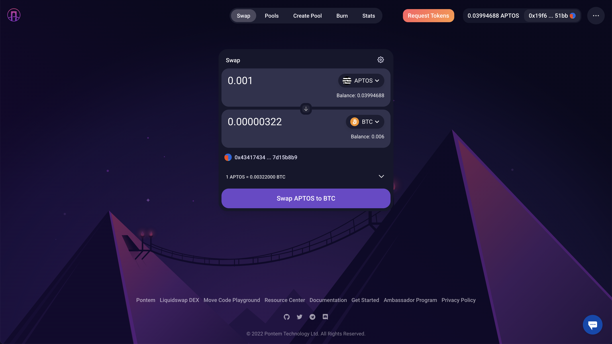

# Introduction

[Liquidswap](https://liquidswap.com) is the first AMM (Automated Market Maker) on the Aptos blockchain, created to enable safe and decentralized token swaps. The protocol uses smart contracts developed by the Pontem Network team, written in the Move language, and published on the Aptos devnet.

Supported features and benefits:

* Uncorrelated token swaps (similar to Uniswap V2);
* Stable swaps for correlated assets, using a different liquidity curve;
* A DAO treasury that receives a part of every swap transaction fee;
* Multiple pools for the same currency pair. Unlike Uniswap, Liquidswap supports the creation of many pools with the same tokens but with different addresses. This is made possible by developing the protocol using the Move language, together with other nice touches like dynamic fees (in R\&D stage). However, the basic set of pools already present in Liquidswap's UI should be enough for most users for now;
* Written in Move: a new smart contract language designed with security in mind;
* High speed thanks to Aptos' parallel transaction execution engine;
* Formal verification partially complete: full formal verification is coming in the future.

## Devnet version

The current version of Liquidswap is deployed on the Aptos devnet and located at [https://liquidswap.com](https://liquidswap.com).

Please test Liquidswap for yourself and share your feedback - it will be greatly appreciated 😊

## Developer Links

For a general idea about Liquidswap, start with the [Protocol Overview](protocol-overview.md).

To get hands-on with the DEX, check out the tutorials:

* [Smart contracts usage & integrations](integration/)
* [Frontend integration](typescript-sdk.md)

Looking for source code? Visit our [Github](https://github.com/pontem-network):

* [Liquidswap Smart Contracts](https://github.com/pontem-network/liquidswap)
* [Liquidswap LP & tests coin](https://github.com/pontem-network/liquidswap-lp)
* [Typescript SDK](https://github.com/pontem-network/liquidswap-sdk)

Need help integrating your service with Liquidswap? Feel free to contact us:

* [Telegram](https://t.me/pontemnetworkchat)
* [Discord](https://discord.gg/44QgPFHYqs)
