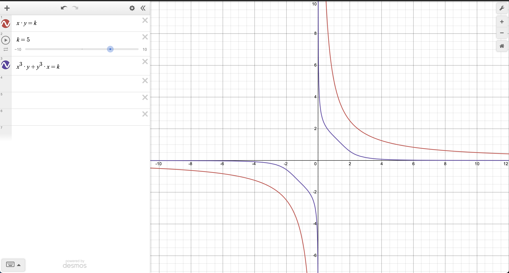

# Protocol Overview

The design of a decentralized AMM was first proposed by Vitalik Buterin in 2016-2017 and later implemented by Uniswap and Bancor. Unlike centralized crypto exchanges with their order books, AMMs allows users to create liquidity pools with tokens of X and Y, where the initial ratio of the two tokens determines their starting relative price and the so-called liquidity curve (the change in price that results from each swap transaction).

Users can swap tokens by providing one side asset in exchange for another and paying a small fee. By contrast, liquidity providers provide both X and Y tokens and earn a share of the transaction fees. When depositing tokens X and Y in a pool, a liquidity provider receives special LP tokens in exchange, which represent their share in the pool and are needed to withdraw the deposited liquidity.

Most AMMs utilize a so-called **Constant Function** - a formula for calculating two tokens' relative prices that ensures that a pool will not be drained as a result of any liquidity event. The standard liquidity curve function, introduced by Uniswap v2, looks as follows:

```
x * y = k
```

In the formula, X and Y are the amounts of the two tokens in a pool, and their product k is a constant. Any trade (swap) changes the amounts X and Y, but k remains the same. This formula is suitable for uncorrelated swaps (assets whose prices aren't correlated with each other) and works well in most cases, including on Liquidswap.

_For swaps between stablecoins and other correlated assets, however, the simple constant product formula is not very effective. In such cases, Liquidswap uses a different, more complex formula to minimize slippage even for large transactions._

## User Flow

Like most DEXes, Liquidswap features two types of users: liquidity providers and traders.

### Liquidity providers

Liquidity providers create new pools and provide liquidity for them (tokens X and Y) so that traders can execute swaps. In return, liquidity providers receive LP tokens. To redeem the liquidity together with the earned fees, they need to burn LP tokens.

Types of liquidity providers:

* Traders who want to earn a passive income;
* Project teams that wish to support their token's price and trading volume by providing initial liquidity;
* DeFi protocols focused on passive income, experimental strategies, etc.

### Traders

Traders interact with a pool's smart contract to swap tokens X for Y or vice versa using the liquidity in the pool. For each swap, a trader pays a fee to the liquidity providers.

_Any AMM (DEX) transaction can be executed using the_ [_Liquidswap Dapp_](https://liquidswap.com) _or direct calls to the deployed smart contracts._

## Fees & Treasury

Liquidswap fees are configurable by treasury multisig and later by DAO.&#x20;

In the current version, all uncorrelated pools are created with default 0.3% fees, and stable pools create with default 0.04% fees.

Out of this, 73% goes to the liquidity providers, while the remaining 0.33% is sent to the treasury contract created for each liquidity pool on the DEX by default. Still, DAO fees are also configurable and can differ pool to pool.

The treasury multisignature can change the fee percent for individual pools.&#x20;

To redeem their accumulated fee rewards, liquidity providers can burn their LP tokens (and redeem the deposited liquidity in the process).

The treasury itself will be initially managed by a multisignature of Pontem and trusted 3rd parties (e.g. Pontem investors, prominent community members, etc.) and will later be migrated to a full-fledged treasury contract managed by the Pontem DAO.

#### Configuration

Current configuration:

* Default fee for uncorrelated pools - 0.3%
* Default fee for stable pools - 0.04%
* Default DAO fee - 33% from general fee.

The treasury or DAO always can change default fees and fees per pool if it follows the next rules:

* Minimum fee for both curves - 0.01%.
* Maximum fee for both curves - 1%.
* Minimum DAO fee - 0%.
* Maximum DAO fee - 100%.

## Stable swaps

Decentralized swaps between stablecoins like USDT, USDC, and DAI have always been a challenge for popular DEXes like Uniswap or SushiSwap because of high slippage – the change in price that occurs as a result of a swap. The problem lies in the standard formula used to calculate the relative prices of two assets in a pool: `x * y = k`, also known as the constant product formula described above.

Without going into too much technical detail, we can say that a single large swap can significantly affect a token’s price, especially when liquidity in the pool is shallow. For stablecoins this is unacceptable, as they should always trade 1:1 (or almost) to each other.

The same goes for pairs like BTC/WBTC and ETH/WETH. They are also called correlated assets, as their relative prices are (or should be) almost ideally correlated.

The solution is to use a different formula for swaps between correlated assets – one that can keep slippage minimal even for large transactions. So far, one of the most successful formulas was proposed by Solidly, a stablecoin DEX on Fantom built by Andre Cronje. It looks as follows:

`x^3*y + x*y^3 = k`.



By default, Liquidswap supports both curves and allows for the creation of two types of pools: uncorrelated pairs and stables.

## Emergency brake

As the Aptos blockchain, the Move language, and Move VM are all very new technologies, it will take time for them to be fully verified and tested. For this reason, we have implemented an emergency brake to stop all liquidity minting and swaps, while simultaneously allowing liquidity providers to burn their LP tokens.

We hope that we will never have to activate the emergency brake, as we have also performed several security audits. Yet, we still want to keep the 'emergency button' in case of an unlikely event of a protocol-level or virtual machine-level issue.

The emergency feature is currently managed by the Pontem team [MSafe](https://github.com/Momentum-Safe) multisignature and can later be transferred to a DAO.

Once we have verified that the protocol is stable and secure enough, we may disable the emergency brake indefinitely.

## Formal verification

Formal verification is a powerful and promising feature of the Move language, but it is still little tested and not perfectly adapted for some use cases.

A formal verification of Liquidswap presents a number of challenges. The team is working on it, but for the time being there is no fixed deadline for its completion.
